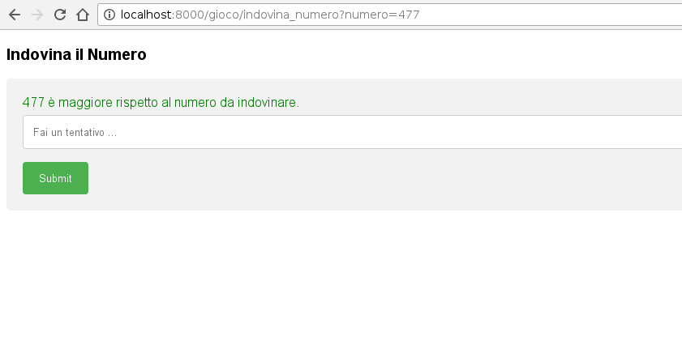

# CorsoPython
Corso Python di sole 3 lezioni, dal terminale al web

## Installazione ed attivazione Ambiente di sviluppo
````
virtualenv -ppython3 CorsoPython.env
source CorsoPython.env/bin/activate
pip3 install Django
````

## Creazione del Progetto
````
django-admin startproject corso_python_django
````

## Setup del Progetto
Copiamo le librerie studiate lungo il corso in una django app creata appositamente.

````
cd corso_python_django
./manage.py startapp gamelibs
````

A seguire copiamo le librerie dei giochi in `gamelibs/`.
Nel mio caso può bastare un collegamento simbolico.
````
ln -s ../../terminale/indovina_la_parola.py
ln -s ../../terminale/lista_parole.txt
ln -s ../../terminale/indovina_numero.py
````

## Creiamo una risorsa web per ogni gioco
Consideriamo i files
`gamelibs/views.py`
e
`gamelibs/urls.py`


## Installiamo l'app nel nostro progetto
In `corso_python_django/settings.py` includeremo nella lista
`INSTALLED_APPS` l'applicazione `gamelibs`.

Aggiungeremo la risorsa all'interno di quelle disponibili in `urls.py`
````
from django.urls import include, path
from django.contrib import admin

from gamelibs.views import indovina_numero_web

urlpatterns = [
    # Examples:
    # url(r'^$', 'corso_python_django.views.home', name='home'),
    # url(r'^blog/', include('blog.urls')),

    # url(r'^admin/', include(admin.site.urls)),
    path('gioco/indovina_numero', indovina_numero_web, name='indovina_numero_web')
]
````

## Eseguiamo il nostro web server
````
./manage.py runserver

April 22, 2019 - 16:39:07
Django version 2.0, using settings 'corso_python_django.settings'
Starting development server at http://127.0.0.1:8000/
Quit the server with CONTROL-C.
````

## Risultato


